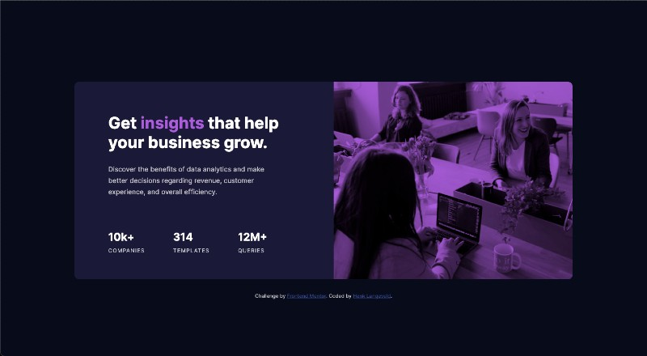
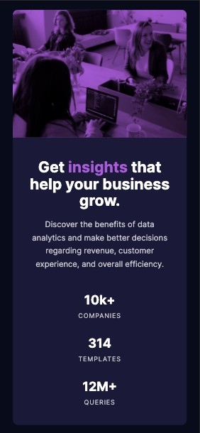

# Frontend Mentor - Stats preview card component solution

This is a solution to the [Stats preview card component challenge on Frontend Mentor](https://www.frontendmentor.io/challenges/stats-preview-card-component-8JqbgoU62). Frontend Mentor challenges help you improve your coding skills by building realistic projects.

## Table of contents

- [Overview](#overview)stats
  - [The challenge](#the-challenge)
  - [Screenshot](#screenshot)
  - [Links](#links)
- [My process](#my-process)

  - [Built with](#built-with)
  - [What I learned](#what-i-learned)

- [Author](#author)

**Note: Delete this note and update the table of contents based on what sections you keep.**

## Overview

### The challenge

Users should be able to:

- View the optimal layout depending on their device's screen size

### Screenshot

Desktop:



Mobile:



### Links

- Solution URL: [Add solution URL here](https://github.com/HenkLangeveld/fm-stats-preview-card)
- Live Site URL: [Add live site URL here](https://frontend-mentor-stats-preview-card-by-henk.netlify.app/)

## My process

After the download of the challenge I've planned out the blocks and where I wanted to use padding and where margin. This made development quicker. I then made the mobile view as pixel perfect as I could. After that I did the same for the desktop version.
I then noticed that the desktop version did not work well below 1400px : the image was not high enough. I made the font-size of the title flexibel using the clamp() function, and also adjusted the padding. It should now show correctly in every viewport width.

### Built with

- Semantic HTML5 markup
- SCSS custom properties
- CSS clamp() function
- CSS mix-blend-mode
- Flexbox
- Mobile-first workflow

### What I learned

This is the first time I used both mix-blend-mode and the clamp() function

```css
img {
  mix-blend-mode: multiply;
}

h1 {
  font-size: clamp(1.9rem, 2.5vw, 2.4rem);
}
```

## Author

- Website - [Henk Langeveld](https://www.henklangeveld.com/)
- Frontend Mentor - [@HenkLangeveld](https://www.frontendmentor.io/profile/HenkLangeveld)
